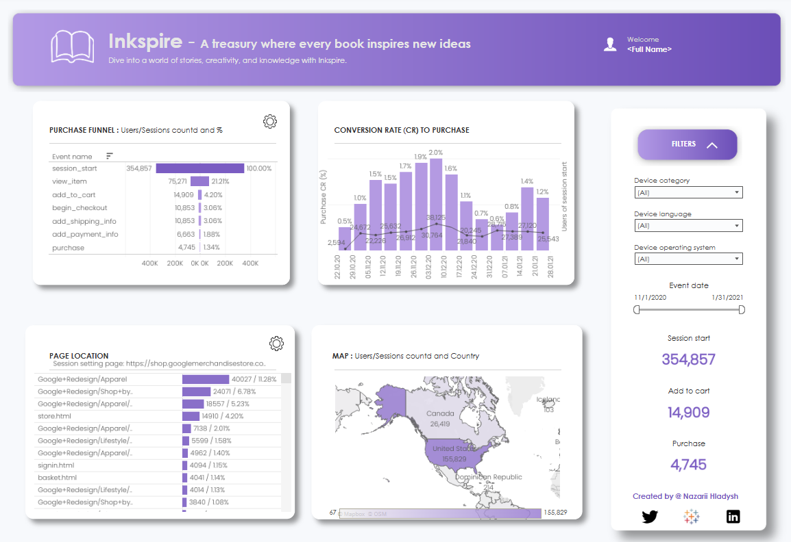

# Inkspire store Analysis 📊 📚
Conducting an analysis of the imaginary Inkspire store’s performance by creating a dashboard that presents data for marketing managers, enabling them to make informed decisions regarding the optimization of advertising campaigns, promotional strategies, and product assortment.

## The interactive dashboard displays information about the imaginary Inkspire store, allowing users to:
* To quickly review the store’s key metrics and conversions (both overall and across key segments)
* Independently explore conversions to identify how they vary depending on visitor groups and traffic sources.

## Tools that were used during the project

<table>
  <tr>
    <td>
      <em>The data for this project was obtained from the public GA4 dataset in <strong>BigQuery</strong>.</em><br/>
      <a href="https://console.cloud.google.com/bigquery?p=bigquery-public-data&d=ga4_obfuscated_sample_ecommerce&t=events_20210131&page=table&project=woven-mapper-422415-j8&ws=!1m5!1m4!4m3!1sbigquery-public-data!2sga4_obfuscated_sample_ecommerce!3sevents_20210131&page=table" target="_blank">Dataset link</a>
    </td>
    <td></td>
  </tr>
  <tr>
    <td>
      <em>The required and processed data were visualized using <strong>Tableau</strong>.</em><br/>
      <a href="https://public.tableau.com/app/profile/nazarii.hladysh/viz/Inkspireproject/dashboard" target="_blank">Dashboard link</a>
    </td>
    <td></td>
  </tr>
</table>

<details>
  <summary>📄 SQL Query with Comments (GA4 Session + Events Join)</summary>

```sql
-- ============================================
-- First CTE: Inkspire
-- Built a table of session-level information:
-- - user & session identifiers
-- - landing page path
-- - geo, device, and traffic source details
-- ============================================
WITH Inkspire AS (
  SELECT
    user_pseudo_id,  -- Unique GA4 user ID

    -- Extracted GA4 session_id from event parameters
    (SELECT value.int_value 
     FROM e.event_params 
     WHERE key = 'ga_session_id') AS session_id,

    -- Created unique composite key: user + session
    user_pseudo_id || 
    (SELECT value.int_value 
     FROM e.event_params 
     WHERE key = 'ga_session_id') AS user_session_id,

    -- Extracted clean page path from full URL
    REGEXP_EXTRACT(
      (SELECT value.string_value 
       FROM e.event_params  
       WHERE key = 'page_location'),
      r'(?:\w+\:\/\/)?[^\/]+\/([^\?#]*)'
    ) AS page_path,

    -- Geo information
    geo.city                 AS city,
    geo.country              AS country,

    -- Device information
    device.category          AS device_category,
    device.language          AS device_language,
    device.operating_system  AS device_operating_system,

    -- Traffic source (source / medium / campaign)
    traffic_source.source    AS source,
    traffic_source.medium    AS medium,
    traffic_source.name      AS campaign

  FROM `bigquery-public-data.ga4_obfuscated_sample_ecommerce.events_*` e
  WHERE event_name = 'session_start'  -- Only session start events
),

-- ============================================
-- Second CTE: Events
-- Built a dataset of selected e-commerce events
-- linked to the same user_session_id key
-- ============================================
Events AS (
  SELECT
    -- Converted microsecond timestamp to date
    DATE(TIMESTAMP_MICROS(event_timestamp)) AS event_date,

    -- Name of the event (purchase, add_to_cart, etc.)
    event_name,

    -- Same composite key used for session mapping
    user_pseudo_id || 
    (SELECT value.int_value 
     FROM e.event_params 
     WHERE key = 'ga_session_id') AS user_session_id

  FROM `bigquery-public-data.ga4_obfuscated_sample_ecommerce.events_*` e

  -- Only events relevant to the ecommerce funnel
  WHERE event_name IN (
    'session_start', 
    'view_item',
    'add_to_cart',
    'begin_checkout',
    'add_shipping_info',
    'add_payment_info',
    'purchase'
  )
)

-- ============================================
-- Final SELECT
-- Executed LEFT JOIN sessions with events using user_session_id
-- Each row = session x event
-- ============================================
SELECT 
  Inkspire.*,    -- Session-level data
  e.event_date,  -- Event date
  e.event_name   -- Event type
FROM Inkspire
LEFT JOIN Events e USING (user_session_id)
LIMIT 5;  -- Limit for preview
```

</details>



> The main elements of the dashboard include **metrics on visits**, **orders**, and **sales**, as well as a visualized **funnel** from store visit to purchase.

## Conclusions Based on the Inkspire Dashboard Analysis:
* ### Seasonality of User Activity.
In early December 2020, an increase in user interest in the Inkspire store was recorded, corresponding to the pre-holiday period. This led to a rise in book views, especially of gift editions and holiday sets, as well as an increase in items added to the shopping cart.

* ### Decline in Activity During the Holiday Period.
At the end of December 2020 and the beginning of January 2021, user activity decreased, resulting in a drop in sales volume. This is expected, considering the end of the holiday season and the reduction in purchasing activity.

* ### User Behavior by Product Categories.
Reading accessories (bookmarks, lamps, covers), which are relatively low-priced, are added to the cart more frequently but have a lower purchase conversion rate. Meanwhile, books across various categories (fiction, educational, children’s literature) show a higher purchase completion rate and a larger average order value, especially gift editions during the holiday period.

* ### Conversion Funnel.
The funnel reveals that the highest user drop-off occurs at the stages of entering shipping and payment information. This may indicate a need to improve the UX/UI or provide additional information regarding the safety and convenience of the payment process.

* ### Impact of Traffic Channels and Devices.
Users coming from advertising campaigns (source, medium, campaign) exhibit varied behavior: some campaigns generate many views and cart additions but have a lower purchase conversion rate. Additionally, desktop users are more likely to complete purchases compared to mobile device users.

## Recommendations for Improving User Experience and Conversions at Inkspire:

### Optimizing the Checkout Process (Checkout UX)
There is a significant drop-off in users at the stages of entering delivery and payment  information.
#### ➤ Recommendations:
* Simplify and streamline the form to make it more intuitive.
* Add tooltips or brief explanations for form fields.
* Implement address auto-completion (e.g., via Google Maps API).
* Display secure payment icons and SSL certification badges.

### Increasing Conversion Rates for Accessories
Accessories are frequently added to the cart but rarely purchased.
#### ➤ Recommendations:
* Implement up-sell/cross-sell tactics such as “Buy together with a book” or “Recommended with this item.”
* Offer discounts on bundles (e.g., book + bookmark).
* Add emotional descriptions or lifestyle photos showing the accessories in use.

### Seasonal Offers and Promotions
The peak activity in December indicates sensitivity to holiday campaigns.
#### ➤ Recommendations:
* Create a dedicated holiday category on the website.
* Launch themed email campaigns before the holidays.
* Introduce a “Book as a Gift” option (including gift wrapping, greeting cards, etc.).
* Promote gift certificates.

### Improving Mobile Experience
Mobile users are more likely to abandon the purchase process.
#### ➤ Recommendations:
* Optimize the mobile version by improving speed and responsiveness.
* Simplify buttons and the checkout interface for mobile devices.
* Reduce the number of clicks required to complete the payment.

### Optimizing Advertising Campaigns
Some traffic sources generate high volume but have low conversion rates.
#### ➤ Recommendations:
* Analyze channel effectiveness and reallocate the budget accordingly.
* Test landing pages for books and categories.
* Launch retargeting campaigns for users who abandoned their carts.

### Improving Landing Page Structure
#### ➤ Recommendations:
* Add user reviews below the books.
* Implement labels such as “Best Seller,” “New Arrival,” and “Seasonal Offer.”
* Include a “Customers Also Viewed...” section to increase session depth.

> ### The overall goal of the recommendations is to smoothly guide the user through the funnel, reduce barriers at each stage, and strengthen the emotional connection with the Inkspire brand.
